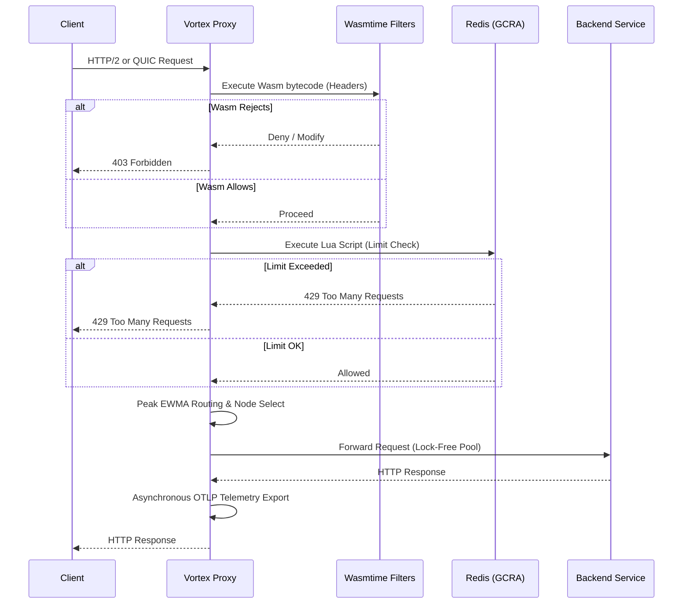

# Vortex Proxy Engine

Vortex is a high-performance, programmable L7 proxy built entirely in Rust. Designed around a Hexagonal Architecture (Ports and Adapters) through a pure multi-crate Cargo workspace, it heavily emphasizes zero-overhead abstractions, non-blocking telemetry, and extreme tailorability via WebAssembly.

## Key Features

### 1. Zero-Copy HTTP Pipeline & Lock-Free Hot Pool

Vortex uses `hyper` to process raw TCP byte-streams without allocating intermediate strings when acting as an L7 bridge. It incorporates a **Hot Pool connection reuse mechanism**, significantly amortizing the cost of TLS and TCP handshakes when talking to upstream microservices. Connections are pooled and managed lock-free.

### 2. Peak EWMA Load Balancing

We built a highly sensitive, lock-free Exponentially Weighted Moving Average (Peak EWMA) algorithm using atomic floating-point bit manipulation (`AtomicU64`).

- Instantly spikes the EWMA upon latency degradation points to shed load immediately.
- Implements an `ActiveRequestGuard` using RAII to mathematically penalize nodes with deep queue depths simultaneously.
- Capable of executing sub-nanosecond scale routing score calculations (measured at ~394 picoseconds via `criterion` benchmarking).

### 3. Distributed GCRA Rate Limiting (Redis & Lua)

Vortex integrates a Redis-backed Generalized Cell Rate Algorithm (GCRA) implementation for distributed rate limiting.

- Utilizes purely atomic operations constructed via `redis::Script` (Lua) ensuring no race conditions for distributed edge clusters.
- `Arc<deadpool_redis::Pool>` connection abstraction isolates contention overheads from the request datapath.

### 4. Wasmtime Integration for Dynamic Edge Computing

To enable on-the-fly request modification, authentication offloading, and dynamic headers (e.g., Cloudflare Workers), we integrated the Bytecode Alliance `wasmtime` engine.

- Bytecodes can be hot-swapped over an internal Administrative UNIX Domain Socket via the `vortex_admin` gRPC service utilizing `arc-swap`.
- Achieves native execution speeds with robust sandboxing.

### 5. High-Resolution Telemetry & MPSC Exporter

Trace aggregation limits datapath speeds if implemented naively.

- W3C TraceContext headers are extracted and propagated directly at the edge.
- Span processing leverages an asynchronous, bounded `mpsc::channel` paired with the `opentelemetry-otlp` protocol to stream high-resolution vectors without throttling latency.
- Features Prometheus histograms natively accessible on a decoupled loopback listener (port `9091`) predicting the edge listener.

### 6. Operational Robustness & Performance Hardening

- **Memory Allocation**: Replaced system malloc with `jemalloc` (`jemallocator`) universally to eliminate memory fragmentation under 100k+ RPS concurrent loads.
- **CPU Pinning**: Integrated `core_affinity` to strictly pin Tokio worker threads to specific physical CPU pipelines, mitigating L1/L2 cache-miss latency penalties during context switches.
- **HTTP/3 (QUIC) Ready**: Initialized a pure `quinn` UDP listener side-by-side with TLS offloading, paving the way for advanced multiplexed QUIC streams at the edge.
- **Zero-Downtime Config Swaps**: Leverages `arc-swap` for atomic routing table updates via an internal gRPC administrative API without dropping active connections.

## Request Flow



## Architecture & Technical Details

- **Concurrency Model**: Vortex utilizes Tokio's work-stealing executor alongside thread-pinning. Cross-thread communication is heavily optimized using atomic lock-free primitives wrapper like `arc-swap`, effectively eliminating mutex contention on the hot path.
- **Control Plane Isolation**: The management APIs (gRPC via Unix Domain Sockets) operate independently of the data plane. Configuration updates, such as backend rotations or WASM payload swaps, happen atomically without interrupting actively proxied streams.
- **Zero-Copy Forwarding**: By leaning on Hyper's streaming traits, the request and response bodies are streamed directly between sockets without intermediate buffering or string allocations.

## Project Structure

The project is structured as a Cargo Workspace utilizing Hexagonal Architecture principles:

- `vortex-core/`: Pure domain interfaces, generic traits (e.g. `RateStore`), data representations, load algorithms (`PeakEwma`), and routing models. Completely decoupled from IO/Networking.
- `vortex-filters/`: Implementations of filtering stacks, WASM runtime environments, and Redis dependencies.
- `vortex-admin/`: Protocol buffer abstractions (`tonic`) serving control plane routing over IPC/Unix sockets.
- `vortex-proxy/`: Top-level integration layer booting the custom `tokio` multi-threaded runtime, TLS offloading (`rustls`), `QUIC` listeners, and observability bootstraps.

## Getting Started

### Prerequisites

- Rust (latest stable)
- Redis (running locally on port 6379 for distributed rate limiting features)
- Protobuf Compiler (`protoc`) for compiling gRPC definitions.

### Building and Running

1. **Clone the repository:**

   ```bash
   git clone <repository-url>
   cd vortex-proxy
   ```

2. **Generate self-signed certificates (for development):**
   *(Note: Vortex currently expects `certs/cert.pem` and `certs/key.pem` in the root directory for TLS and QUIC).*

   ```bash
   mkdir certs
   openssl req -x509 -newkey rsa:4096 -keyout certs/key.pem -out certs/cert.pem -days 365 -nodes -subj "/CN=localhost"
   ```

3. **Run the proxy:**

   ```bash
   cargo run --release -p vortex-proxy
   ```

4. **Run tests & benchmarks:**

   ```bash
   cargo test --workspace
   cargo bench -p vortex-core
   ```
