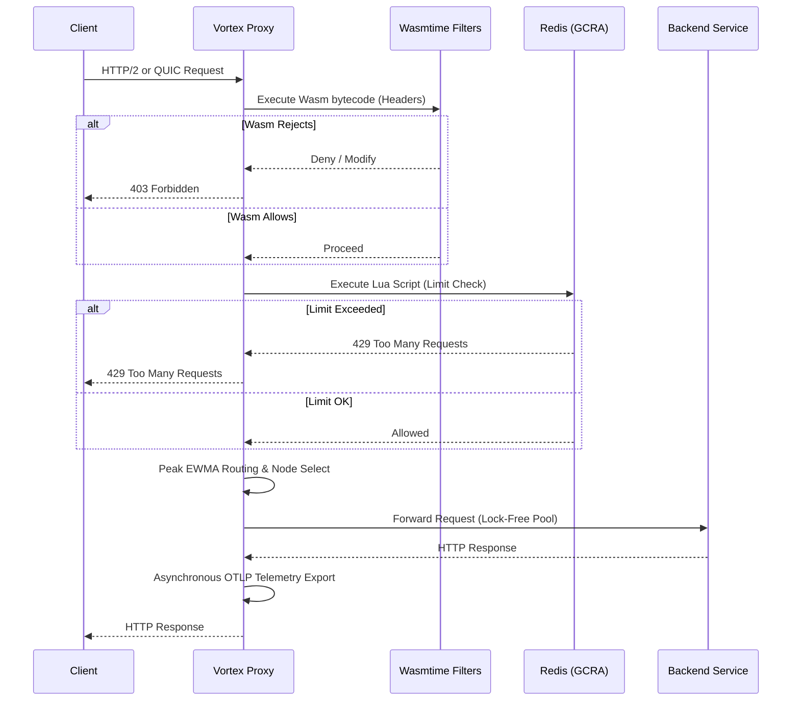

# Vortex Proxy Engine

[](https://github.com/ichbingautam/vortex-proxy/actions/workflows/ci.yml)
[](https://www.rust-lang.org/)
[](LICENSE)

Vortex is a high-performance, programmable L7 proxy built entirely in Rust. Designed around a Hexagonal Architecture (Ports and Adapters) through a pure multi-crate Cargo workspace, it heavily emphasizes zero-overhead abstractions, non-blocking telemetry, and extreme tailorability via WebAssembly.

## 🚀 Why Vortex? (Our USP)

**Vortex is the only API Gateway that natively merges eBPF kernel-level hardware packet drops with WebAssembly (Wasm) edge extensibility and lock-free Peak EWMA routing into a single, memory-safe Rust binary.** 

Unlike Envoy or NGINX which rely on heavy legacy C++ codebases or multiple sidecars to achieve these features, Vortex gives you 10M+ RPS capacity, instant L3/L4 DDoS mitigation, and dynamic Cloudflare-like edge compute natively in a sub-10MB distroless container.

---

## Workspace Architecture

Vortex is structured as a Cargo workspace using Hexagonal Architecture principles to decouple core domain logic from I/O boundaries:

* [vortex-core](file:///Users/gautamshubham/projects/practices/vortex-proxy/vortex-core): Pure domain models, generic traits (e.g., `RateStore`), circuit breaker states, and the Peak EWMA load-balancing algorithm. Completely decoupled from database and socket I/O.
* [vortex-filters](file:///Users/gautamshubham/projects/practices/vortex-proxy/vortex-filters): WASM runtime engine (Wasmtime-backed), Proxy-WASM ABI host bindings, and the Redis-backed GCRA rate-limiter.
* [vortex-admin](file:///Users/gautamshubham/projects/practices/vortex-proxy/vortex-admin): Local gRPC control plane over UNIX Domain Sockets (`/tmp/vortex_admin.sock`) and a Kubernetes Custom Resource Definition (CRD) watcher for zero-downtime routing swaps.
* [vortex-ebpf](file:///Users/gautamshubham/projects/practices/vortex-proxy/vortex-ebpf): Pre-compiled kernel-space XDP filters (`xdp_drop.c`) and an Aya-based BPF loader.
* [vortex-proxy](file:///Users/gautamshubham/projects/practices/vortex-proxy/vortex-proxy): Top-level integration layer booting the Tokio runtime, pinning worker threads to CPU affinity, and managing TLS, QUIC, telemetry, and background sweepers.

---

## Key Features

### 1. Zero-Copy HTTP Pipeline & Lock-Free Hot Pool
Vortex uses `hyper` to process raw TCP byte-streams without allocating intermediate strings when acting as an L7 bridge. It incorporates a **Hot Pool connection reuse mechanism**, significantly amortizing the cost of TLS and TCP handshakes when talking to upstream microservices. Connections are pooled and managed lock-free.

### 2. Peak EWMA Load Balancing
We built a highly sensitive, lock-free Exponentially Weighted Moving Average (Peak EWMA) algorithm using atomic floating-point bit manipulation (`AtomicU64`).
* Instantly spikes the EWMA upon latency degradation points to shed load immediately.
* Implements an `ActiveRequestGuard` using RAII to mathematically penalize nodes with deep queue depths simultaneously.
* Executes sub-nanosecond scale routing score calculations (measured at ~394 picoseconds via `criterion` benchmarking).

### 3. Distributed GCRA Rate Limiting (Redis & Lua)
Vortex integrates a Redis-backed Generalized Cell Rate Algorithm (GCRA) implementation for distributed rate limiting.
* Utilizes purely atomic operations constructed via `redis::Script` (Lua) ensuring no race conditions for distributed edge clusters.
* `Arc<deadpool_redis::Pool>` connection abstraction isolates contention overheads from the request datapath.

### 4. Wasmtime Integration for Dynamic Edge Computing
To enable on-the-fly request modification, authentication offloading, and dynamic headers (e.g., Cloudflare Workers), we integrated the Bytecode Alliance `wasmtime` engine.
* Bytecodes can be hot-swapped over an internal Administrative UNIX Domain Socket via the `vortex_admin` gRPC service utilizing `arc-swap`.
* Achieves native execution speeds with robust sandboxing.

### 5. High-Resolution Telemetry & MPSC Exporter
Trace aggregation limits datapath speeds if implemented naively.
* W3C TraceContext headers are extracted and propagated directly at the edge.
* Span processing leverages an asynchronous, bounded `mpsc::channel` paired with the `opentelemetry-otlp` protocol to stream high-resolution vectors without throttling latency.
* Features Prometheus histograms natively accessible on a decoupled loopback listener (port `9091`).

### 6. eBPF / XDP Kernel-Level Traffic Mitigation
To protect the backend from volumetric DDoS attacks, Vortex integrates an eBPF/XDP packet filter.
* Drops abusive packets directly at the network interface card (NIC) layer before they even reach the Linux network stack or the Rust application layer.
* Instantly mitigates L3/L4 attacks at line-rate.

### 7. Lock-Free Circuit Breakers
* Incorporates robust `CircuitBreaker` states (`Closed`, `Open`, `HalfOpen`) into the core domain.
* Automatically isolates failing backends from the routing table and returns structured `503 JSON` errors, preventing cascading timeouts across the system.

### 8. Operational Robustness & Performance Hardening
* **Wasmtime Pooling**: Integrates the `PoolingAllocationConfig` to pre-warm up to 1,000 Wasm sandboxes, eliminating JIT memory fragmentation.
* **Memory Allocation**: Replaced system malloc with `jemalloc` (`jemallocator`) universally to eliminate memory fragmentation under 100k+ RPS concurrent loads.
* **CPU Pinning**: Integrated `core_affinity` to strictly pin Tokio worker threads to specific physical CPU pipelines, mitigating L1/L2 cache-miss latency penalties during context switches.
* **HTTP/3 (QUIC) Ready**: Initialized a pure `quinn` UDP listener side-by-side with TLS offloading, paving the way for advanced multiplexed QUIC streams at the edge.
* **Graceful Shutdown**: Employs `tokio::sync::broadcast` for zero-downtime listener draining on SIGINT.
* **Kubernetes Native**: Fully equipped with multi-stage Docker builds, `HorizontalPodAutoscaler`, and Argo Rollouts Canary progressive delivery manifests.

---

## Request Flow



---

## Technical Deep Dive & API References

### 1. The Peak EWMA Autonomous Load Balancer

Most proxies rely on Round-Robin or Least Connections. Under severe load spikes, these algorithms fail to react rapidly to degrading nodes (the "noisy neighbor" problem). Vortex implements an atomic, lock-free **Peak EWMA (Exponentially Weighted Moving Average)**.

**The Math & Logic**:
* **Recovery Decay**: When latency is recovering (dropping), the EWMA updates using classical temporal decay: `EWMA_new = (R * (1 - α)) + (EWMA_old * α)` (where `α` is the decay rate, e.g., 0.5).
* **Instant Peak Tracking**: If latency spikes *above* the historical average, `EWMA_new` jumps instantly to `R` to immediately penalize the node.
* **Routing Score**: The final route score incorporates active queue depth via `Score = (EWMA + 1) * (ActiveRequests + 1)`. A lower score wins. This calculation executes in **~394 picoseconds**, allowing routing decisions to be made at hyper-scale without locking.

### 2. Wasmtime Execution Edge API

Vortex enables dynamic L7 filtering (headers manipulation, authentication, custom routing) via WebAssembly.

#### A. Direct Guest Execution
Vortex executes a `.wasm` filter compiled from C, Rust, or AssemblyScript by invoking its exported `execute` function:
```wasm
(module
    (func (export "execute") (result i32)
        i32.const 200
    )
)
```

#### B. Standard Proxy-WASM ABI
Vortex has been upgraded to natively implement the standard **[Proxy-WASM ABI](https://github.com/proxy-wasm/spec)** host environment. This allows Vortex to run thousands of existing Envoy, Istio, and Proxy-Wasm plugins out-of-the-box. 

Vortex registers the following core Proxy-WASM ABI host functions on the Wasmtime Linker under the `env` module:
* `proxy_log(level: i32, message_data: i32, message_size: i32) -> i32`
* `proxy_get_header_map_value(map_type: i32, key_data: i32, key_size: i32, return_value_data: i32, return_value_size: i32) -> i32`
* `proxy_continue_stream(stream_type: i32) -> i32`

Vortex invokes the guest lifecycle handler `proxy_on_request_headers` to process request payloads:
```wasm
;; Host calls guest callback with (root_context_id, plugin_context_id, stream_id)
(call $proxy_on_request_headers (i32.const 1) (i32.const 2) (i32.const 3))
```

---

### 3. Unix Socket Admin API (gRPC/ProtoBuf)

Vortex exposes a local Control Plane over a Unix Domain Socket (`/tmp/vortex_admin.sock`) using `tonic` (gRPC). This enables zero-downtime hot-reloading of routing rules, performance stats extraction, and plugin deployments.

**Service Definition ([admin.proto](file:///Users/gautamshubham/projects/practices/vortex-proxy/vortex-admin/proto/admin.proto))**:

```protobuf
syntax = "proto3";
package vortex.admin;

service AdminService {
    rpc ReloadConfig (ReloadConfigRequest) returns (ReloadConfigResponse);
    rpc GetStats (GetStatsRequest) returns (GetStatsResponse);
    rpc UpdateWasmPlugin (UpdateWasmRequest) returns (UpdateWasmResponse);
}

message ReloadConfigRequest {
    string config_path = 1;
}

message ReloadConfigResponse {
    bool success = 1;
    string message = 2;
}

message GetStatsRequest {}

message GetStatsResponse {
    uint32 active_connections = 1;
}

message UpdateWasmRequest {
    bytes wasm_binary = 1;
}

message UpdateWasmResponse {
    bool success = 1;
    string message = 2;
}
```

State swaps are executed globally using the `arc-swap` crate, ensuring that active TCP streams maintain `Arc` references to their origin routing graphs indefinitely until disconnected, achieving true **zero-downtime draining**.

---

### 4. Kubernetes Custom Resource (VortexRoute) Watcher

Vortex incorporates a Kubernetes controller that watches the API Server namespaces for updates on Custom Resources representing routing topologies. The watcher utilizes `kube-rs` to subscribe to events and perform atomic routing table swaps.

**Custom Resource Definition Spec (`vortex.dev/v1alpha1`, Kind: `VortexRoute`)**:
A `VortexRoute` custom resource defines backends and optional metadata such as supported AI models.

**Example Manifest**:
```yaml
apiVersion: vortex.dev/v1alpha1
kind: VortexRoute
metadata:
  name: main-routing-topology
  namespace: default
spec:
  backends:
    - id: 1
      address: "10.0.1.10:8443"
      ai_models:
        - "gpt-4"
        - "gpt-3.5-turbo"
    - id: 2
      address: "10.0.1.20:8443"
      ai_models:
        - "claude-3-opus"
```

---

### 5. eBPF/XDP Rate Limiting & BanManager Sweeper

When a downstream client exhausts its rate limits (based on GCRA Redis checks), Vortex triggers a kernel-space ban to defend the proxy at line-rate.

* **Kernel Banishment**: The `BanManager` uses `vortex-ebpf` to insert the abusive client's IPv4 address into the `BLOCKED_IPS` BPF map.
* **XDP Early Drop**: The eBPF/XDP filter program (`xdp_drop.c`) intercepts packets directly at the NIC layer (`eth0`) and returns `XDP_DROP` if the source IP matches the map, bypassing the kernel network stack and the Rust user-space binary entirely.
* **Background Sweeper**: A background thread runs a sweeper loop at a specified interval (e.g., every 5 seconds) to clean up expired IP bans. It calls `unblock_ip` to remove the IP from the BPF map, allowing the client to reconnect.

---

### 6. Data Plane API Responses (Client-Facing)

VortexProxy interacts with downstream clients through standard HTTP semantics, intercepting abusive or failing traffic natively.

* **`429 Too Many Requests`**:
  Triggered when the distributed GCRA Redis token bucket is exhausted for a specific client IP.
  ```json
  {
    "error": "Rate limit exceeded",
    "retry_after_ms": 1500
  }
  ```

* **`503 Service Unavailable`**:
  Triggered when the Peak EWMA router detects that all upstream nodes are unreachable, or when the atomic **Circuit Breaker** flips to the `Open` state.
  ```json
  {
    "error": "Service Unavailable",
    "message": "Circuit breaker open or all backend nodes are offline."
  }
  ```

* **`403 Forbidden`**:
  Triggered when the dynamic Wasmtime filter explicitly rejects a request (e.g., invalid Authentication headers or unauthorized JWT tokens) returning a `proxy_pause` ABI code.

---

## Getting Started

### Prerequisites

* **Rust** (latest stable)
* **Redis** (running locally on port `6379` for distributed rate limiting)
* **Protobuf Compiler** (`protoc`) for compiling gRPC schemas

### Building and Running

1. **Clone the repository:**
   ```bash
   git clone <repository-url>
   cd vortex-proxy
   ```

2. **Generate self-signed certificates (for development TLS & QUIC):**
   Vortex expects `certs/cert.pem` and `certs/key.pem` in the root directory for TLS and QUIC listeners.
   ```bash
   mkdir -p certs
   openssl req -x509 -newkey rsa:4096 -keyout certs/key.pem -out certs/cert.pem -days 365 -nodes -subj "/CN=localhost"
   ```

3. **Compile and run the proxy:**
   ```bash
   make build
   cargo run --release -p vortex-proxy
   ```

4. **Run tests and benchmarks:**
   ```bash
   make test
   make bench
   ```

5. **Run lint checks and formatter:**
   ```bash
   make lint
   make format
   ```

6. **Deploy to Kubernetes:**
   ```bash
   make docker-build
   make k8s-deploy
   ```

7. **Perform load testing:**
   Vortex comes with a load-testing script utilizing `Vegeta`:
   ```bash
   make load-test
   ```

---

## 🤝 Contributing

We are actively looking for open-source contributors to help push Vortex to the absolute limits of edge computing!

### How you can help:
* **eBPF & XDP**: Expand our kernel-level networking filters to drop specific DDoS attack vectors natively.
* **Wasm Plugins**: Build and share custom Proxy-WASM plugins (e.g., JWT validators, Rate Limiters) written in Rust, Go, or AssemblyScript.
* **Protocol Support**: Help us finalize full HTTP/3 (QUIC) and gRPC multiplexing support.
* **Observability**: Integrate deeper OpenTelemetry tracing metrics and Jaeger dashboards.

Check out our issues tab, fork the repository, and submit a Pull Request! All code must pass `make lint` and `make test`.

**Join us in building the fastest, safest, and most programmable L7 proxy in the open-source ecosystem!**
