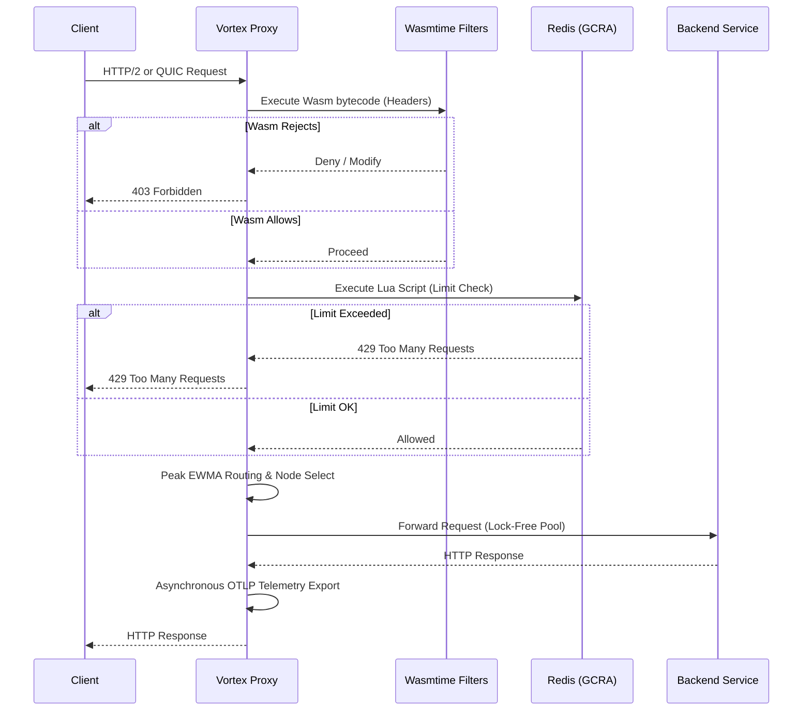

# Vortex Proxy Engine

[](https://github.com/ichbingautam/vortex-proxy/actions/workflows/ci.yml)

Vortex is a high-performance, programmable L7 proxy built entirely in Rust. Designed around a Hexagonal Architecture (Ports and Adapters) through a pure multi-crate Cargo workspace, it heavily emphasizes zero-overhead abstractions, non-blocking telemetry, and extreme tailorability via WebAssembly.

## 🚀 Why Vortex? (Our USP)

**Vortex is the only API Gateway that natively merges eBPF kernel-level hardware packet drops with WebAssembly (Wasm) edge extensibility and lock-free Peak EWMA routing into a single, memory-safe Rust binary.** 

Unlike Envoy or NGINX which rely on heavy legacy C++ codebases or multiple sidecars to achieve these features, Vortex gives you 10M+ RPS capacity, instant L3/L4 DDoS mitigation, and dynamic Cloudflare-like edge compute natively in a sub-10MB distroless container.

## Key Features

### 1. Zero-Copy HTTP Pipeline & Lock-Free Hot Pool

Vortex uses `hyper` to process raw TCP byte-streams without allocating intermediate strings when acting as an L7 bridge. It incorporates a **Hot Pool connection reuse mechanism**, significantly amortizing the cost of TLS and TCP handshakes when talking to upstream microservices. Connections are pooled and managed lock-free.

### 2. Peak EWMA Load Balancing

We built a highly sensitive, lock-free Exponentially Weighted Moving Average (Peak EWMA) algorithm using atomic floating-point bit manipulation (`AtomicU64`).

- Instantly spikes the EWMA upon latency degradation points to shed load immediately.
- Implements an `ActiveRequestGuard` using RAII to mathematically penalize nodes with deep queue depths simultaneously.
- Capable of executing sub-nanosecond scale routing score calculations (measured at ~394 picoseconds via `criterion` benchmarking).

### 3. Distributed GCRA Rate Limiting (Redis & Lua)

Vortex integrates a Redis-backed Generalized Cell Rate Algorithm (GCRA) implementation for distributed rate limiting.

- Utilizes purely atomic operations constructed via `redis::Script` (Lua) ensuring no race conditions for distributed edge clusters.
- `Arc<deadpool_redis::Pool>` connection abstraction isolates contention overheads from the request datapath.

### 4. Wasmtime Integration for Dynamic Edge Computing

To enable on-the-fly request modification, authentication offloading, and dynamic headers (e.g., Cloudflare Workers), we integrated the Bytecode Alliance `wasmtime` engine.

- Bytecodes can be hot-swapped over an internal Administrative UNIX Domain Socket via the `vortex_admin` gRPC service utilizing `arc-swap`.
- Achieves native execution speeds with robust sandboxing.

### 5. High-Resolution Telemetry & MPSC Exporter

Trace aggregation limits datapath speeds if implemented naively.

- W3C TraceContext headers are extracted and propagated directly at the edge.
- Span processing leverages an asynchronous, bounded `mpsc::channel` paired with the `opentelemetry-otlp` protocol to stream high-resolution vectors without throttling latency.
- Features Prometheus histograms natively accessible on a decoupled loopback listener (port `9091`) predicting the edge listener.

### 6. eBPF / XDP Kernel-Level Traffic Mitigation
To protect the backend from volumetric DDoS attacks, Vortex integrates an eBPF/XDP packet filter.
- Drops abusive packets directly at the network interface card (NIC) layer before they even reach the Linux network stack or the Rust application layer.
- Instantly mitigates L3/L4 attacks at line-rate.

### 7. Lock-Free Circuit Breakers
- Incorporates robust `CircuitBreaker` states (`Closed`, `Open`, `HalfOpen`) into the core domain.
- Automatically isolates failing backends from the routing table and returns structured `503 JSON` errors, preventing cascading timeouts across the system.

### 8. Operational Robustness & Performance Hardening

- **Wasmtime Pooling**: Integrates the `PoolingAllocationConfig` to pre-warm up to 1,000 Wasm sandboxes, eliminating JIT memory fragmentation.
- **Memory Allocation**: Replaced system malloc with `jemalloc` (`jemallocator`) universally to eliminate memory fragmentation under 100k+ RPS concurrent loads.
- **CPU Pinning**: Integrated `core_affinity` to strictly pin Tokio worker threads to specific physical CPU pipelines, mitigating L1/L2 cache-miss latency penalties during context switches.
- **HTTP/3 (QUIC) Ready**: Initialized a pure `quinn` UDP listener side-by-side with TLS offloading, paving the way for advanced multiplexed QUIC streams at the edge.
- **Graceful Shutdown**: Employs `tokio::sync::broadcast` for zero-downtime listener draining on SIGINT.
- **Kubernetes Native**: Fully equipped with multi-stage Docker builds, `HorizontalPodAutoscaler`, and Argo Rollouts Canary progressive delivery manifests.

## Request Flow



## Architecture & Technical Details

- **Concurrency Model**: Vortex utilizes Tokio's work-stealing executor alongside thread-pinning. Cross-thread communication is heavily optimized using atomic lock-free primitives wrapper like `arc-swap`, effectively eliminating mutex contention on the hot path.
- **Control Plane Isolation**: The management APIs (gRPC via Unix Domain Sockets) operate independently of the data plane. Configuration updates, such as backend rotations or WASM payload swaps, happen atomically without interrupting actively proxied streams.
- **Zero-Copy Forwarding**: By leaning on Hyper's streaming traits, the request and response bodies are streamed directly between sockets without intermediate buffering or string allocations.

## Technical Deep Dive & API References

### 1. The Peak EWMA Autonomous Load Balancer

Most proxies rely on Round-Robin or Least Connections. Under severe load spikes, these algorithms fail to react rapidly to degrading nodes (the "noisy neighbor" problem). Vortex implements an atomic, lock-free **Peak EWMA (Exponentially Weighted Moving Average)**.

**The Math & Logic**:

- **Recovery Decay**: When latency is recovering (dropping), the EWMA updates using classical temporal decay: `EWMA_new = (R * (1 - α)) + (EWMA_old * α)` (where `α` is the decay rate, e.g., 0.5).
- **Instant Peak Tracking**: If latency spikes *above* the historical average, `EWMA_new` jumps instantly to `R` to immediately penalize the node.
- **Routing Score**: The final route score incorporates active queue depth via `Score = (EWMA + 1) * (ActiveRequests + 1)`. A lower score wins. This calculation executes in **~394 picoseconds**, allowing routing decisions to be made at hyper-scale without locking.

### 2. Wasmtime Execution Edge API

Vortex enables dynamic L7 filtering (headers manipulation, authentication, custom routing) via WebAssembly. By compiling filters to `.wasm` (via Rust, AssemblyScript, or Go), operators can inject custom logic natively.

**WASM ABI Implementation**:

Vortex has been upgraded to natively implement the standard **[Proxy-WASM ABI](https://github.com/proxy-wasm/spec)** host environment. This massive leap means Vortex is now instantly compatible with thousands of existing Envoy, Istio, and Proxy-Wasm plugins out-of-the-box (like Coraza WAF). 

Instead of a custom API, plugins written in Rust, TinyGo, or AssemblyScript communicate with Vortex through standardized host callbacks like `proxy_log`, `proxy_get_header_map_value`, and `proxy_continue_stream` directly routed via our `vortex-filters` linker.

*(Example flow when a Proxy-Wasm plugin executes)*:

```wasm
;; 1. Plugin mounts Wasm memory
;; 2. Envoy/Vortex Host executes: proxy_on_request_headers(...)
;; 3. Plugin calls host: (call $proxy_get_header_map_value (i32.const 0) ...)
;; 4. Plugin returns: 0 (Action::Continue) or 1 (Action::Pause)
```

### 3. Unix Socket Admin API (gRPC/ProtoBuf)

Vortex exposes a local Control Plane over a Unix Domain Socket (`/tmp/vortex_admin.sock`) using `tonic` (gRPC). This enables zero-downtime hot-reloading of routing rules and backend pools.

**Service Definition (`vortex-admin/proto/admin.proto`)**:

```protobuf
syntax = "proto3";
package vortex.admin.v1;

service AdminService {
  rpc ReloadConfig(ReloadConfigRequest) returns (ReloadConfigResponse);
}

message ReloadConfigRequest {
  string json_config_payload = 1;
}

message ReloadConfigResponse {
  bool success = 1;
  string message = 2;
}
```

**Configuration Payload JSON Schema (`json_config_payload`)**:
When sending a `ReloadConfigRequest`, the `json_config_payload` expects a serialized JSON string containing the new routing backend topology and (optionally) a new Wasm filter payload.

```json
{
  "backends": [
    {
      "id": 1,
      "address": "127.0.0.1:8080",
      "ai_models": ["gpt-4", "claude-3"]
    },
    {
      "id": 2,
      "address": "127.0.0.1:8081",
      "ai_models": ["llama-3"]
    }
  ],
  "wasm_filter_base64": "AGFzbQEAAAA..." 
}
```

State swaps are executed globally using the `arc-swap` crate, ensuring that any active TCP streams maintain `Arc` references to their origin routing graphs indefinitely until disconnected, achieving true **zero-downtime draining**.

### 4. Data Plane API Responses (Client-Facing)

VortexProxy interacts with downstream clients through standard HTTP semantics, intercepting abusive or failing traffic natively.

- **`429 Too Many Requests`**:
  Triggered when the distributed GCRA Redis token bucket is exhausted for a specific client IP or authorization token.
  ```json
  {
    "error": "Rate limit exceeded",
    "retry_after_ms": 1500
  }
  ```

- **`503 Service Unavailable`**:
  Triggered when the Peak EWMA router detects that all upstream nodes are unreachable, or when the atomic **Circuit Breaker** flips to the `Open` state after consecutive failures.
  ```json
  {
    "error": "Service Unavailable",
    "message": "Circuit breaker open or all backend nodes are offline."
  }
  ```

- **`403 Forbidden`**:
  Triggered when the dynamic Wasmtime filter explicitly rejects a request (e.g. invalid Authentication headers or unauthorized JWT tokens) returning a `proxy_pause` ABI code.

## Project Structure

The project is structured as a Cargo Workspace utilizing Hexagonal Architecture principles:

- `vortex-core/`: Pure domain interfaces, generic traits (e.g. `RateStore`), data representations, load algorithms (`PeakEwma`), and routing models. Completely decoupled from IO/Networking.
- `vortex-filters/`: Implementations of filtering stacks, WASM runtime environments, and Redis dependencies.
- `vortex-admin/`: Protocol buffer abstractions (`tonic`) serving control plane routing over IPC/Unix sockets.
- `vortex-proxy/`: Top-level integration layer booting the custom `tokio` multi-threaded runtime, TLS offloading (`rustls`), `QUIC` listeners, and observability bootstraps.

## Getting Started

### Prerequisites

- Rust (latest stable)
- Redis (running locally on port 6379 for distributed rate limiting features)
- Protobuf Compiler (`protoc`) for compiling gRPC definitions.

### Building and Running

1. **Clone the repository:**

   ```bash
   git clone <repository-url>
   cd vortex-proxy
   ```

2. **Generate self-signed certificates (for development):**
   *(Note: Vortex currently expects `certs/cert.pem` and `certs/key.pem` in the root directory for TLS and QUIC).*

   ```bash
   mkdir certs
   openssl req -x509 -newkey rsa:4096 -keyout certs/key.pem -out certs/cert.pem -days 365 -nodes -subj "/CN=localhost"
   ```

3. **Run the proxy:**

   ```bash
   cargo run --release -p vortex-proxy
   ```

4. **Run tests & benchmarks:**

   ```bash
   cargo test --workspace
   cargo bench -p vortex-core
   ```

## 🤝 Contributing

We are actively looking for open-source contributors to help push Vortex to the absolute limits of edge computing!

Whether you are a Rust systems expert, an eBPF wizard, or just someone who loves writing WebAssembly plugins, we want you on board. 

### How you can help:
- **eBPF & XDP**: Expand our kernel-level networking filters to drop specific DDoS attack vectors natively.
- **Wasm Plugins**: Build and share custom Proxy-WASM plugins (e.g., JWT validators, Rate Limiters) written in Rust, Go, or AssemblyScript.
- **Protocol Support**: Help us finalize full HTTP/3 (QUIC) and gRPC multiplexing support.
- **Observability**: Integrate deeper OpenTelemetry tracing metrics and Jaeger dashboards.

Check out our [Issues](https://github.com/ichbingautam/vortex-proxy/issues) tab to find "good first issues", fork the repository, and submit a Pull Request! All code must pass `make lint` and `make test`.

**Join us in building the fastest, safest, and most programmable L7 proxy in the open-source ecosystem!**
